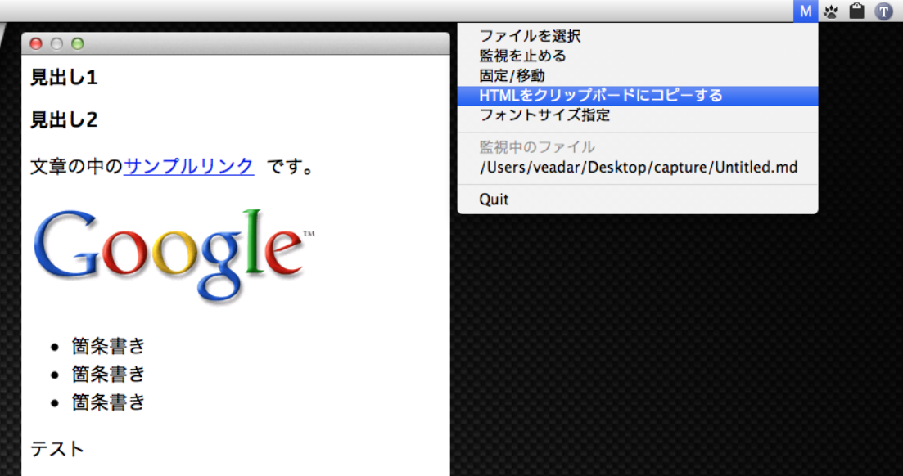
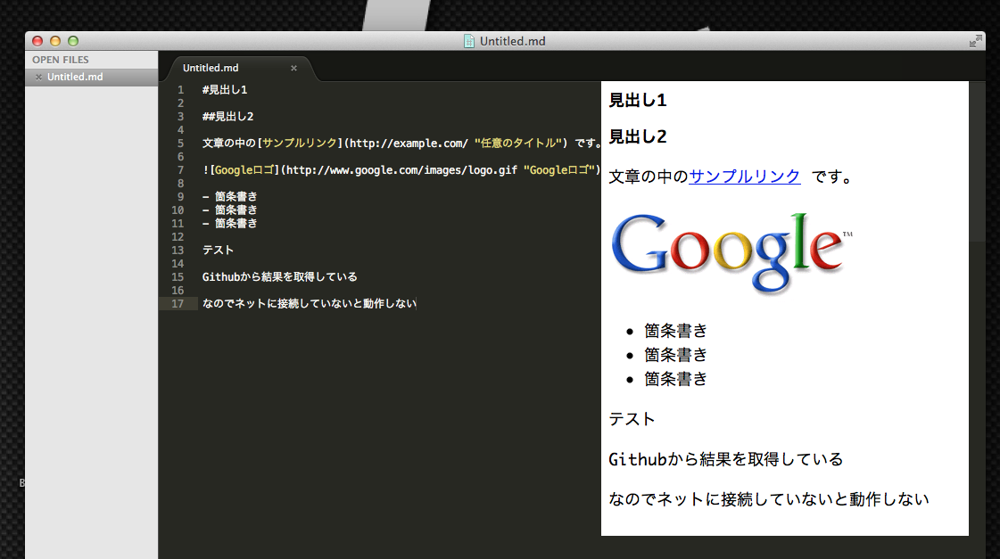

#Markdown to HTML

##これは何？

簡素なMarkdownプレビューアです。

サービスメニューもしくはドラッグ＆ドロップからMarkdownファイルを開きます。

##対応 OS

OS X 10.10以降(おそらく)

##スクリーンショット

##機能

- タイトルバーとフチなしウィンドウ
- クリックスルーかつ最前面
- HTMLをクリップボードに格納

##ダウンロード

Downloadをクリック → [Download](https://github.com/veadar/Markdown-to-HTML/releases)

##参考にさせていただいたコードと使用アイコン

- [MMMarkdown](https://github.com/mdiep/MMMarkdown)
- [MenubarAppleScript](http://memogakisouko.appspot.com/MenuBarAppleScript.html)